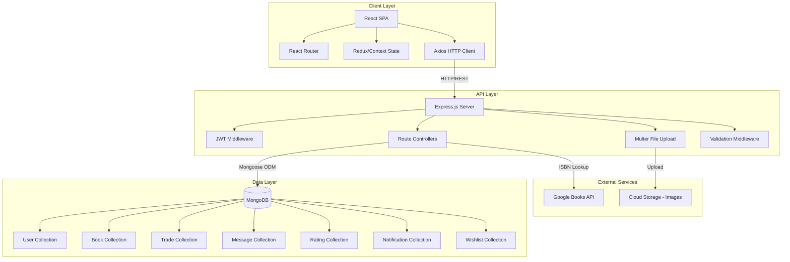
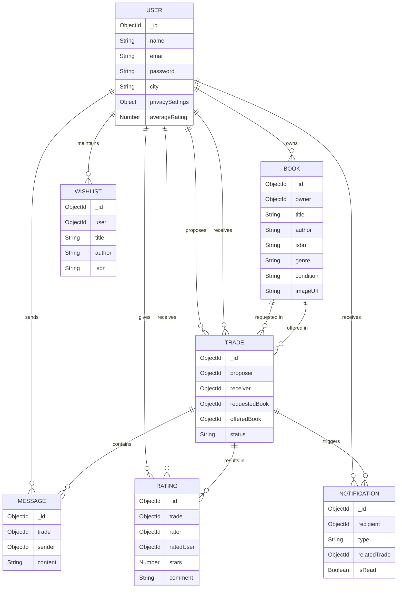

# Design Document

## Overview

BookVerse is a full-stack MERN application that facilitates peer-to-peer book trading with a focus on fairness, trust, and community. The system architecture follows a three-tier model: a React frontend for user interaction, an Express.js REST API backend for business logic, and MongoDB for data persistence. The design emphasizes security through JWT authentication, user empowerment through rich information display, and community trust through transparent ratings and privacy controls.

### Key Design Principles

1. **User Empowerment**: Provide diagnostic information (ISBN, condition, photos) to enable informed trading decisions
2. **Trust Through Transparency**: Implement contextual ratings and public wishlists to build community trust
3. **Privacy Control**: Give users granular control over their information visibility
4. **Scalability**: Design stateless APIs and efficient database schemas for future growth
5. **Security First**: Implement authentication, authorization, input validation, and secure data handling throughout

## Architecture

### System Architecture Diagram



### Technology Stack Rationale

**Frontend: React.js**
- Component-based architecture enables reusable UI elements (BookCard, TradeCard, etc.)
- Virtual DOM provides efficient updates for real-time features (notifications, chat)
- Rich ecosystem of libraries for routing, state management, and form handling

**Backend: Node.js + Express.js**
- JavaScript across the stack reduces context switching and enables code sharing
- Non-blocking I/O handles concurrent requests efficiently (important for chat and notifications)
- Middleware architecture simplifies authentication, validation, and error handling
- Lightweight and fast for REST API development

**Database: MongoDB**
- Document-based model naturally fits nested data structures (user profiles with listings, trades with messages)
- Flexible schema accommodates evolving requirements without migrations
- Efficient querying for complex filters (city, genre, author)
- Horizontal scalability for future growth

**Authentication: JWT (JSON Web Tokens)**
- Stateless authentication enables horizontal scaling
- Self-contained tokens reduce database lookups
- Industry-standard approach with broad library support

## Components and Interfaces

### Frontend Components

#### Core Layout Components
- **App**: Root component with routing configuration
- **Navbar**: Navigation with authentication state, notification badge, user menu
- **Footer**: Static links including Safety Guidelines
- **ProtectedRoute**: HOC that enforces authentication for private pages

#### Authentication Components
- **RegisterForm**: User registration with email, password, name, city fields
- **LoginForm**: User login with email and password
- **AuthContext**: Global authentication state management

#### Book Management Components
- **BookListingForm**: Create/edit book listings with image upload and ISBN lookup
- **BookCard**: Display book summary with thumbnail, title, author, condition
- **BookDetailView**: Full book information with owner profile link and trade button
- **MyBooksPage**: User's own book inventory with edit/delete actions

#### Search and Discovery Components
- **BrowsePage**: Main search interface with filter sidebar
- **SearchFilters**: City, genre, and author filter controls
- **BookGrid**: Responsive grid layout for search results

#### Wishlist Components
- **WishlistForm**: Add books to wishlist
- **WishlistItem**: Display wishlist entry with remove option
- **WishlistSection**: Display on user profile

#### Trading Components
- **TradeProposalModal**: Select own book to offer in trade
- **TradeCard**: Display trade summary with status and action buttons
- **TradeDetailView**: Full trade information with chat interface
- **TradeList**: User's incoming and outgoing trades

#### Communication Components
- **ChatBox**: Trade-specific messaging interface
- **MessageBubble**: Individual message display with timestamp
- **MessageInput**: Text input with send button

#### Rating Components
- **RatingForm**: Star rating with conditional comment field
- **RatingDisplay**: Show average rating and individual reviews
- **RatingCard**: Individual rating with stars, comment, and date

#### Notification Components
- **NotificationBell**: Icon with unread count badge
- **NotificationDropdown**: List of recent notifications
- **NotificationItem**: Individual notification with type-specific formatting

#### Profile Components
- **UserProfile**: Display user information, ratings, listings, and wishlist
- **ProfileSettings**: Edit profile with privacy toggle
- **PrivacyToggle**: Switch control for city visibility

### Backend API Endpoints

#### Authentication Routes (`/api/auth`)
```
POST   /register          - Create new user account
POST   /login             - Authenticate user and return JWT
GET    /me                - Get current user profile (protected)
PUT    /profile           - Update user profile (protected)
```

#### Book Routes (`/api/books`)
```
POST   /                  - Create new book listing (protected)
GET    /                  - Get all books with optional filters (city, genre, author)
GET    /:id               - Get single book by ID
PUT    /:id               - Update book listing (protected, owner only)
DELETE /:id               - Delete book listing (protected, owner only)
POST   /isbn/:isbn        - Lookup book data from External API
```

#### Wishlist Routes (`/api/wishlist`)
```
POST   /                  - Add book to wishlist (protected)
GET    /user/:userId      - Get user's wishlist
DELETE /:id               - Remove book from wishlist (protected)
```

#### Trade Routes (`/api/trades`)
```
POST   /                  - Propose new trade (protected)
GET    /                  - Get user's trades (protected)
GET    /:id               - Get single trade details (protected)
PUT    /:id/accept        - Accept trade proposal (protected)
PUT    /:id/decline       - Decline trade proposal (protected)
PUT    /:id/complete      - Mark trade as complete (protected)
```

#### Message Routes (`/api/messages`)
```
POST   /                  - Send message in trade chat (protected)
GET    /trade/:tradeId    - Get all messages for a trade (protected)
```

#### Rating Routes (`/api/ratings`)
```
POST   /                  - Submit rating for completed trade (protected)
GET    /user/:userId      - Get all ratings for a user
```

#### Notification Routes (`/api/notifications`)
```
GET    /                  - Get user's notifications (protected)
PUT    /:id/read          - Mark notification as read (protected)
PUT    /read-all          - Mark all notifications as read (protected)
```

### API Request/Response Examples

#### Create Book Listing
```javascript
// Request
POST /api/books
Headers: { Authorization: "Bearer <jwt_token>" }
Body: {
  title: "The Great Gatsby",
  author: "F. Scott Fitzgerald",
  condition: "Good",
  genre: "Classic Fiction",
  isbn: "9780743273565",
  description: "Classic American novel in good condition"
}
File: image (multipart/form-data)

// Response
{
  success: true,
  data: {
    _id: "507f1f77bcf86cd799439011",
    title: "The Great Gatsby",
    author: "F. Scott Fitzgerald",
    condition: "Good",
    genre: "Classic Fiction",
    isbn: "9780743273565",
    description: "Classic American novel in good condition",
    imageUrl: "https://storage.../books/507f1f77bcf86cd799439011.jpg",
    owner: "507f191e810c19729de860ea",
    createdAt: "2025-09-15T10:30:00Z"
  }
}
```

#### Propose Trade
```javascript
// Request
POST /api/trades
Headers: { Authorization: "Bearer <jwt_token>" }
Body: {
  requestedBook: "507f1f77bcf86cd799439011",
  offeredBook: "507f1f77bcf86cd799439012"
}

// Response
{
  success: true,
  data: {
    _id: "507f1f77bcf86cd799439013",
    proposer: "507f191e810c19729de860ea",
    receiver: "507f191e810c19729de860eb",
    requestedBook: { /* book object */ },
    offeredBook: { /* book object */ },
    status: "proposed",
    createdAt: "2025-09-15T11:00:00Z"
  }
}
```

## Data Models

### User Model
```javascript
{
  _id: ObjectId,
  name: String (required),
  email: String (required, unique, lowercase),
  password: String (required, hashed with bcrypt),
  city: String (required),
  privacySettings: {
    showCity: Boolean (default: true)
  },
  averageRating: Number (default: 0, calculated field),
  ratingCount: Number (default: 0),
  createdAt: Date,
  updatedAt: Date
}

// Indexes
- email (unique)
- city (for filtering)
```

### Book Model
```javascript
{
  _id: ObjectId,
  owner: ObjectId (ref: 'User', required),
  title: String (required),
  author: String (required),
  isbn: String (optional),
  genre: String (required),
  condition: String (required, enum: ['New', 'Like New', 'Good', 'Fair', 'Poor']),
  description: String,
  imageUrl: String (required),
  publicationYear: Number,
  publisher: String,
  isAvailable: Boolean (default: true),
  createdAt: Date,
  updatedAt: Date
}

// Indexes
- owner
- genre
- author (text index for search)
- title (text index for search)
- compound: [owner, isAvailable]
```

### Wishlist Model
```javascript
{
  _id: ObjectId,
  user: ObjectId (ref: 'User', required),
  title: String (required),
  author: String,
  isbn: String,
  notes: String,
  createdAt: Date
}

// Indexes
- user
- compound: [user, isbn] (unique, sparse)
```

### Trade Model
```javascript
{
  _id: ObjectId,
  proposer: ObjectId (ref: 'User', required),
  receiver: ObjectId (ref: 'User', required),
  requestedBook: ObjectId (ref: 'Book', required),
  offeredBook: ObjectId (ref: 'Book', required),
  status: String (required, enum: ['proposed', 'accepted', 'declined', 'completed']),
  proposedAt: Date,
  respondedAt: Date,
  completedAt: Date,
  createdAt: Date,
  updatedAt: Date
}

// Indexes
- proposer
- receiver
- status
- compound: [proposer, status]
- compound: [receiver, status]
```

### Message Model
```javascript
{
  _id: ObjectId,
  trade: ObjectId (ref: 'Trade', required),
  sender: ObjectId (ref: 'User', required),
  content: String (required, max: 1000 characters),
  createdAt: Date
}

// Indexes
- trade (for fetching conversation)
- compound: [trade, createdAt] (for chronological ordering)
```

### Rating Model
```javascript
{
  _id: ObjectId,
  trade: ObjectId (ref: 'Trade', required, unique per rater),
  rater: ObjectId (ref: 'User', required),
  ratedUser: ObjectId (ref: 'User', required),
  stars: Number (required, min: 1, max: 5),
  comment: String (required if stars <= 3),
  createdAt: Date
}

// Indexes
- ratedUser (for calculating average)
- compound: [trade, rater] (unique - one rating per user per trade)
```

### Notification Model
```javascript
{
  _id: ObjectId,
  recipient: ObjectId (ref: 'User', required),
  type: String (required, enum: ['trade_request', 'trade_accepted', 'trade_declined', 'trade_completed', 'new_message']),
  relatedTrade: ObjectId (ref: 'Trade'),
  relatedUser: ObjectId (ref: 'User'),
  message: String (required),
  isRead: Boolean (default: false),
  createdAt: Date
}

// Indexes
- recipient
- compound: [recipient, isRead]
- createdAt (TTL index: expire after 30 days)
```

### Data Relationships



## Error Handling

### Error Response Format

All API errors follow a consistent format:

```javascript
{
  success: false,
  error: {
    message: "Human-readable error message",
    code: "ERROR_CODE",
    details: {} // Optional additional context
  }
}
```

### Error Categories and HTTP Status Codes

**400 Bad Request**
- Invalid input data (validation failures)
- Missing required fields
- Malformed request body

**401 Unauthorized**
- Missing JWT token
- Invalid or expired JWT token
- Authentication required

**403 Forbidden**
- User attempting to access/modify resources they don't own
- Insufficient permissions for action

**404 Not Found**
- Requested resource doesn't exist
- Invalid resource ID

**409 Conflict**
- Duplicate email during registration
- Attempting to rate the same trade twice
- Book already in wishlist

**500 Internal Server Error**
- Database connection failures
- Unexpected server errors
- External API failures (Google Books)

### Error Handling Middleware

```javascript
// Global error handler
app.use((err, req, res, next) => {
  console.error(err.stack);
  
  // Mongoose validation errors
  if (err.name === 'ValidationError') {
    return res.status(400).json({
      success: false,
      error: {
        message: 'Validation failed',
        code: 'VALIDATION_ERROR',
        details: err.errors
      }
    });
  }
  
  // JWT errors
  if (err.name === 'JsonWebTokenError') {
    return res.status(401).json({
      success: false,
      error: {
        message: 'Invalid token',
        code: 'INVALID_TOKEN'
      }
    });
  }
  
  // Default error
  res.status(err.statusCode || 500).json({
    success: false,
    error: {
      message: err.message || 'Internal server error',
      code: err.code || 'INTERNAL_ERROR'
    }
  });
});
```

### Frontend Error Handling

- Display user-friendly error messages in UI
- Toast notifications for transient errors
- Form validation errors inline with fields
- Retry logic for network failures
- Fallback UI for failed data loads

## Security Considerations

### Authentication and Authorization

**Password Security**
- Hash passwords with bcrypt (salt rounds: 10)
- Never store or transmit plain-text passwords
- Enforce minimum password length (8 characters)

**JWT Implementation**
- Sign tokens with strong secret key (environment variable)
- Set reasonable expiration (24 hours)
- Include user ID in payload
- Validate on every protected route

**Authorization Checks**
- Verify resource ownership before modifications
- Implement middleware for common checks
- Validate trade participants before allowing actions

### Input Validation and Sanitization

**Backend Validation**
- Use express-validator for all inputs
- Sanitize strings to prevent XSS
- Validate email format
- Enforce maximum lengths
- Whitelist allowed values for enums

**Frontend Validation**
- Client-side validation for UX
- Never trust client-side validation alone
- Validate before submission

### API Security

**Rate Limiting**
- Implement express-rate-limit
- Stricter limits on authentication endpoints (5 attempts per 15 minutes)
- General API limits (100 requests per 15 minutes per IP)

**CORS Configuration**
- Whitelist frontend domain only
- Restrict allowed methods
- Include credentials for JWT cookies

**File Upload Security**
- Validate file types (images only)
- Limit file size (5MB maximum)
- Generate unique filenames
- Scan for malware (production consideration)
- Store in separate domain/CDN

### Data Privacy

**Privacy Controls**
- Honor user privacy toggle for city visibility
- Don't expose email addresses in API responses
- Filter sensitive data in user objects

**HTTPS**
- Enforce HTTPS in production
- Redirect HTTP to HTTPS
- Use secure cookies for tokens

## Testing Strategy

### Unit Testing

**Backend Unit Tests (Jest + Supertest)**
- Model validation logic
- Utility functions (password hashing, JWT generation)
- Middleware functions (authentication, authorization)
- Individual route handlers

**Frontend Unit Tests (Jest + React Testing Library)**
- Component rendering
- User interactions (clicks, form submissions)
- State management logic
- Utility functions

### Integration Testing

**API Integration Tests**
- Complete request/response cycles
- Database interactions
- Authentication flows
- Error handling paths

**Test Scenarios**
- User registration and login
- Book CRUD operations
- Trade lifecycle (propose → accept → complete → rate)
- Wishlist management
- Notification creation and delivery
- Search and filtering

### End-to-End Testing

**Critical User Flows (Cypress or Playwright)**
- Complete registration → login → create listing → logout flow
- Search → view book → propose trade → communicate → complete → rate flow
- Wishlist creation and matching
- Notification interaction

### Testing Data

**Test Database**
- Separate MongoDB instance for testing
- Seed data for consistent tests
- Clean database between test suites

**Mock External Services**
- Mock Google Books API responses
- Mock file upload service

### Test Coverage Goals

- Backend: 80% code coverage minimum
- Frontend: 70% code coverage minimum
- 100% coverage of critical paths (authentication, trading, ratings)

## Performance Considerations

### Database Optimization

- Appropriate indexes on frequently queried fields
- Compound indexes for common filter combinations
- Pagination for list endpoints (default: 20 items per page)
- Populate only necessary fields in queries
- Use lean() for read-only queries

### Frontend Optimization

- Code splitting by route
- Lazy loading for images
- Debounce search inputs
- Cache API responses where appropriate
- Optimize bundle size

### Caching Strategy

- Cache static content (Safety Guidelines)
- Browser caching for images
- Consider Redis for session storage (future enhancement)

### Scalability Considerations

- Stateless API design enables horizontal scaling
- Database connection pooling
- CDN for static assets and images
- Load balancer for multiple server instances (production)

## Deployment Architecture

### Development Environment

- Local MongoDB instance
- Node.js development server with hot reload
- React development server with hot module replacement
- Environment variables in .env file

### Production Environment

**Frontend Deployment (Vercel/Netlify)**
- Build optimized production bundle
- Deploy to CDN
- Configure environment variables
- Set up custom domain

**Backend Deployment (Heroku/Railway/DigitalOcean)**
- Deploy Node.js application
- Configure environment variables
- Set up MongoDB Atlas connection
- Enable HTTPS

**Database (MongoDB Atlas)**
- Managed MongoDB cluster
- Automated backups
- Connection string in environment variables

**File Storage (Cloudinary/AWS S3)**
- Cloud storage for book images
- CDN delivery
- API keys in environment variables

### Environment Variables

```
# Backend
NODE_ENV=production
PORT=5000
MONGODB_URI=mongodb+srv://...
JWT_SECRET=<strong_random_secret>
JWT_EXPIRE=24h
GOOGLE_BOOKS_API_KEY=<api_key>
CLOUDINARY_CLOUD_NAME=<cloud_name>
CLOUDINARY_API_KEY=<api_key>
CLOUDINARY_API_SECRET=<api_secret>
FRONTEND_URL=https://bookverse.com

# Frontend
REACT_APP_API_URL=https://api.bookverse.com
```

## Future Enhancements

While not part of the MVP, these enhancements are architecturally considered:

1. **Real-time Features**: WebSocket integration for live chat and notifications
2. **Advanced Matching**: Algorithm to suggest trades based on wishlist and inventory overlap
3. **Mobile App**: React Native application using same backend API
4. **Social Features**: Follow users, book clubs, reading lists
5. **Analytics Dashboard**: User statistics, popular books, trade metrics
6. **Email Notifications**: Supplement in-app notifications with email
7. **Multi-language Support**: i18n implementation
8. **Advanced Search**: Full-text search with Elasticsearch
9. **Recommendation Engine**: ML-based book recommendations
10. **Moderation Tools**: Admin dashboard for community management
